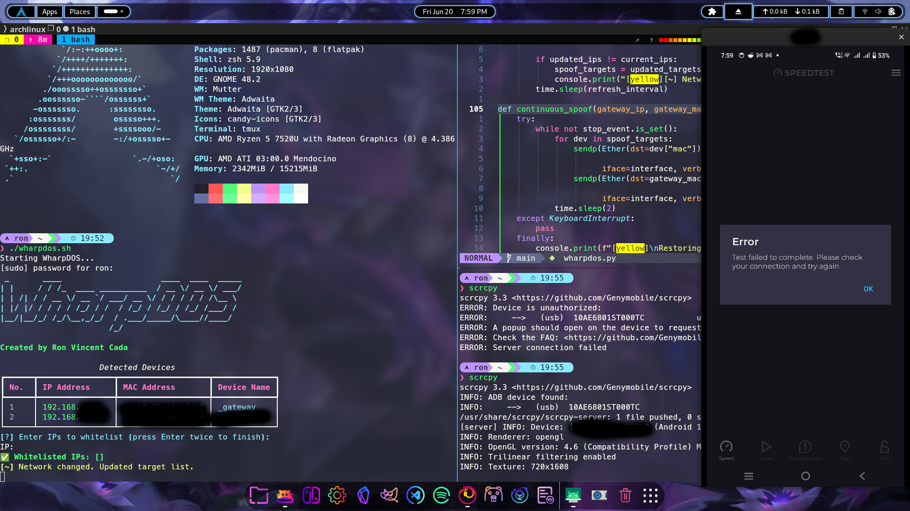

# WharpDOS – ARP Denial-of-Service Educational Tool 🛡️

> ⚠️ For **educational purposes only**. Do not use this tool on any network you do not own or have explicit permission to test.

WharpDOS is a Python-based local network ARP spoofing and denial-of-service tool built for learning purposes. It scans devices on a LAN, allows IP whitelisting, and selectively cuts off internet access for unauthorized devices by poisoning their ARP caches — without packet forwarding.

This project was developed in a **controlled environment** to understand how LAN-based DoS attacks work at the protocol level using ARP spoofing techniques.

---

## 📦 Features

- Detects devices via ARP scanning
- IP address whitelisting
- Dynamic monitoring for network changes
- Real-time ARP spoofing
- Drops packets (no forwarding, DoS-style behavior)
- Rich CLI interface with banners, tables, and prompts

---

## 📸 Screenshot

---

## 🛠️ Technologies Used

- Python 3
- [Scapy](https://scapy.net/) – for crafting raw Ethernet/ARP packets
- [netifaces](https://pypi.org/project/netifaces/) – for interface/gateway detection
- [prompt_toolkit](https://github.com/prompt-toolkit/python-prompt-toolkit) – for interactive CLI
- [rich](https://github.com/Textualize/rich) – for styled terminal UI
- socket, threading, sys – for system-level networking logic

---

## How It Works

1. Scans local subnet (`192.168.x.x/24`) using ARP requests.
2. Builds a list of active devices.
3. Lets you **whitelist trusted IPs** (e.g., your own laptop, gateway).
4. Continuously sends spoofed ARP replies to target devices and the router, misleading them into routing through the attacker — but does **not forward traffic**, causing internet loss.

---

## OS Compatibility

This tool is designed and tested on **Linux** (developed in an Arch Linux environment).  
It requires **root privileges** to run and access network interfaces for raw packet manipulation.

🛑 Not compatible with Windows or macOS due to platform limitations on raw sockets and interface control.

---

## 📌 Ethical Usage Notice

WharpDOS is intended for:
- Penetration testing simulations
- Cybersecurity self-study
- Demonstrations in ethical hacking workshops

**Do not deploy this on any production or shared network without proper authorization.**

---

## 🔧 Setup

```bash
git clone https://github.com/lucifron28/wharpdos.git
cd wharpdos
python3 -m venv venv
source venv/bin/activate
pip install -r requirements.txt
sudo python3 wharpdos.py <interface>
```

Make sure your user has permissions to run `scapy` and access raw sockets.

## Author
GitHub: [@lucifron28](https://github.com/lucifron28)  
LinkedIn: [Ron Vincent Cada](https://www.linkedin.com/in/ron-vincent-cada-a939282a7/)

---

## License

MIT License — For educational use only.
